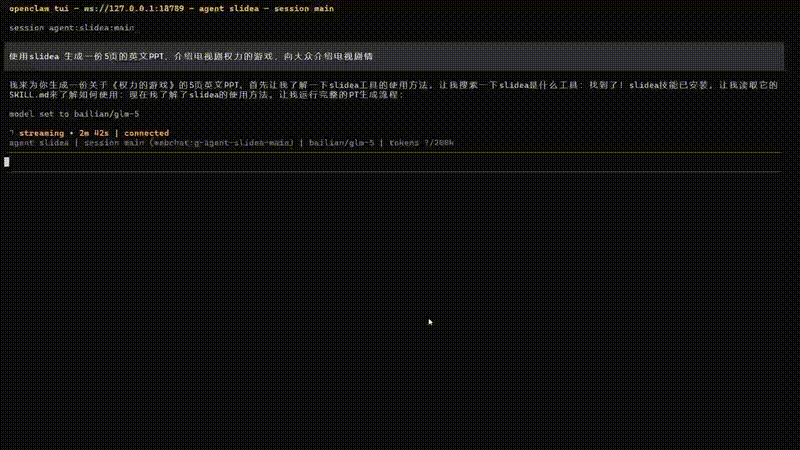
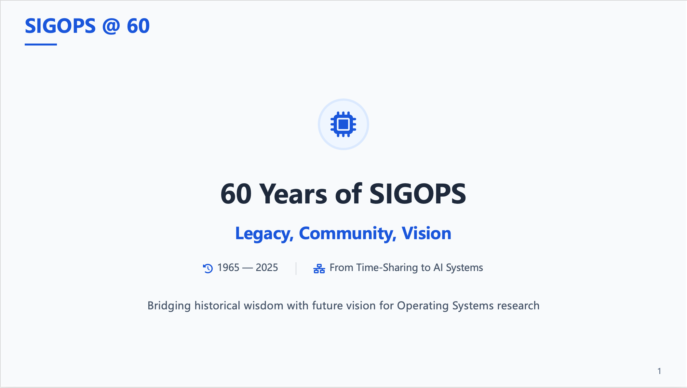

<div align="center">

# Slidea

[中文](README_CN.md) | English

[](./docs/example/assets/demo.mp4)

</div>

***Slidea*** is an **AI-driven PPT generation skill** that turns a high-level presentation request into structured research material, writing direction, a slide outline, and finally a presentation-ready PPT deck.

---

| Example 1 (English) | Example 2 (English) |
|---------------------|---------------------|
| <b>SIGOPS Workshop (Kimi-k2.5)</b><br><a href="./docs/example/sigops.pptx"></a><br><br><details><summary>View Prompt</summary><br>Please make me an opening slides for the SIGOPS strategic workshop (https://ipads.se.sjtu.edu.cn/sigops-strategic/), emphasizing the long history of SIGOPS and the community and this is the 60th anniversary of SIGOPS (https://www.sigops.org/about/history/), review the 2015 SOSP History Day (https://sigops.org/s/conferences/sosp/2015/history/), the high-quality of the program, the two great keynote speeches, and the program for visionary talks, as well as the two great panels and workshop Session schedule. Please make around 8-10 slides.</details> | <b>Wuthering Heights Introduction (Kimi-k2.5)</b><br><a href="./docs/example/book.pptx"></a><br><br><details><summary>View Prompt</summary><br>Help me create an English PowerPoint presentation to introduce the book Wuthering Heights</details> |

| Example 3 (Chinese) | Example 4 (Chinese) |
|---------------------|---------------------|
| <b>AI Agent Overview (Gemini-3-pro)</b><br><a href="./docs/example/agent.pptx"></a><br><br><details><summary>View Prompt</summary><br>帮我生成一个30页左右的PPT，内容是关于AI Agent，包括AI Agent基本原理，主要框架、面临的挑战、学术界进展，以及未来的机会点。</details> | <b>Kindergarten Stand-up Show (DeepSeek-V3.2)</b><br><a href="./docs/example/child.pptx"></a><br><br><details><summary>View Prompt</summary><br>请帮我生成一份5岁小朋友脱口秀的ppt，演讲题目是“假如我会魔法”</details> |

---

## What Slidea Can Do

Given a request such as "create a 10-slide PPT about AI Agents for product, engineering, and business leaders", Slidea can:

- parse the request into structured requirements,
- collect source material from user input, URLs, and optional search,
- generate the writing direction for the full deck,
- turn that writing direction into a slide outline,
- render each slide as HTML, merge and export PDF, and finally export PPTX.

The system is designed for agent-driven usage. It supports staged execution, resuming after interruptions, and other flexible workflows. This staged design exists mainly for two reasons:

- generation quality is more stable when research, planning, outlining, and rendering are separated;
- intermediate outputs can be cached, inspected, edited, resumed, or reused.


## Quick Start: Install Slidea as a Skill Through an Agent (Recommended)

Slidea is primarily intended to be installed as a skill inside an agent environment. If your agent platform supports local skills, you can install Slidea easily. After installation, configure `.env` according to the current two-tier routing setup. In most cases you only need to configure `DEFAULT_LLM` first. If you want to enable `PREMIUM` mode, keep `PREMIUM_LLM_MODEL=google/gemini-3.1-pro-preview` and `PREMIUM_LLM_API_BASE_URL=https://openrouter.ai/api/v1` unchanged, and usually only fill in `PREMIUM_LLM_API_KEY`.

The Slidea skill currently supports openEuler, Apple Silicon macOS, Windows WSL/PowerShell, and some other Linux environments. It can be installed and run conveniently in mainstream agent environments such as OpenClaw, Codex, and Claude Code.

### Install the Slidea Skill

To install the Slidea skill, you can send the following instruction to your agent:

```text
Please fetch and follow the installation instructions for the Slidea skill here: https://raw.gitcode.com/openeuler/capsule/raw/master/application/slidea/skill/INSTALL.md
```

After the model resources are installed and configured for Slidea, restart the agent so it reloads the installed skill. Then invoke Slidea using the skill entry style supported by your agent environment.

### Use the Slidea Skill

In an environment like OpenClaw, you might call it like this:

```text
Use the slidea skill to create a PPT about AI Agents, around 10 slides, targeted at product, engineering, and business leaders
```

In an environment like Claude Code that supports slash-style skill commands, you might call it like this:

```text
/slidea Create a PPT about AI Agents, around 10 slides, targeted at product, engineering, and business leaders
```

The exact syntax depends on the host agent, but the expected experience is the same: the agent loads the Slidea skill, gathers missing information when needed, and runs the slide generation pipeline to final artifacts.

### Supported Platforms

| Platform | Architecture | Support |
| --- | --- | --- |
| Linux | x86_64 / ARM64 | openEuler supported |
| Linux | x86_64 | Ubuntu/Debian supported |
| Windows | x86_64 / ARM64 | ✅ |
| macOS | Apple Silicon | ✅ |

### Use from source

If you want to contribute to Slidea itself, or you need to debug the repository locally, you can use Slidea directly from source.

1. Fetch the source code and enter the directory:
   ```bash
   git clone https://gitcode.com/openeuler/capsule.git
   cd capsule/application/slidea
   ```

2. Use the script to automatically create the virtual environment and install the required dependencies.
   This step automatically handles Python dependencies, the Playwright browser, and LibreOffice-related setup.
   ```bash
   python3 scripts/install/install.py
   ```

3. Configure environment variables.
   If the script has not already created `.env`, run:
   ```bash
   cp .env.example .env
   ```
   Then configure at least these values in `.env`:
   - `SLIDEA_MODE`
   - `DEFAULT_LLM_MODEL`
   - `DEFAULT_LLM_API_KEY`
   - `DEFAULT_LLM_API_BASE_URL`
   These settings currently support OpenAI-compatible APIs only.
   The minimum runnable setup is `SLIDEA_MODE=ECONOMIC` plus the three `DEFAULT_LLM_*` values.
   If you want premium-routed callsites to use the premium model first, also fill in `PREMIUM_LLM_API_KEY`.
   `PREMIUM_LLM_MODEL` and `PREMIUM_LLM_API_BASE_URL` already have fixed recommended defaults and should usually not be changed. The only recommended premium model right now is `google/gemini-3.1-pro-preview`.

4. Run an example:
   ```bash
   .venv/bin/python scripts/run_ppt_pipeline.py \
     --text "Create a 10-slide PPT introducing AI Agents" \
     --session-id session_test \
     --run-id id_test
   ```

   If `session-id` and `run-id` are not specified, the system uses the current time as the default identifier value. In the example above, `session_test` and `id_test` are just sample strings.

5. Resume an interrupted run

   PPT generation may pause during execution to interact with the user. The Slidea CLI supports resuming an interrupted PPT generation task.

   For example, when `scripts/run_ppt_pipeline.py` returns `stage: "input_required"`, it means additional user input is required. In that case, call the CLI again with the same `run_id`, `session_id`, and `--resume`.

   Example:

   ```bash
   .venv/bin/python scripts/run_ppt_pipeline.py \
     --resume "targeted at product, engineering, and business leaders" \
     --session-id session_test \
     --run-id id_test
   ```

   Here `session_test` and `id_test` are identifiers that were created earlier for a run that was interrupted.

For more commands, see `docs/cli.md`.

If you do not want to use the installer in step 2 to prepare the runtime automatically, you can also set it up manually:

```bash
python3 -m venv .venv
. .venv/bin/activate
pip install -r requirements.txt
python -m playwright install chromium
```

LibreOffice (version >= 25.2) can be downloaded and installed from:
`https://www.libreoffice.org/download/download-libreoffice/`

## Repository Structure

- `scripts/`: user-facing CLI entrypoints, including skill export, the full pipeline, staged execution, patch rendering, and nested installation helpers
- `skill/`: the exported skill package definition directory, including `SKILL.md`, `INSTALL.md`, and the skill manifest
- `core/`: the main LangGraph applications, including deep research, PPT generation, and shared core utilities
- `docs/`: public-facing documentation, including quick start, CLI, architecture, and app documentation
- `tests/`: regression tests for portability, CLI contracts, and runtime behavior

## Core Subsystems

### PPT Generator

`core/ppt_generator/` is responsible for presentation-oriented generation.

It turns source material into:

- a writing direction for the presentation,
- a slide outline,
- page-level HTML renders,
- and final PDF / PPTX artifacts.

This subsystem is split out to separate "how to think about the deck" from "how to render the deck".

During PPT rendering, Slidea uses a few-shot approach to keep generated layouts visually consistent.

At the moment, Slidea includes five built-in templates: general light, general dark, red political, academic report, and child-friendly science/popularization. By default, Slidea automatically selects the most suitable template based on the user's topic, but users can also explicitly request a specific template style in the PPT generation prompt.

### Deep Research

`core/deep_research/` is responsible for recursive research and long-form synthesis.

It does not render slides. Instead, it expands a broad request into a structured research process, including question decomposition, evidence collection, gap review, and research outputs that can be consumed by the presentation pipeline.

Use this subsystem when insight generation is needed before slide planning.

## CLI Overview

Slidea mainly exposes four script entrypoints:

- `scripts/install/install.py`: initializes local runtime dependencies for source usage or exported skill packages, and is called during skill installation
- `scripts/export_skill.py`: exports the skill package from the source tree, and is called during skill installation
- `scripts/run_ppt_pipeline.py`: the main generation pipeline, supports staged execution, and is called when a PPT generation task starts
- `scripts/patch_render_missing.py`: selectively re-renders missing or specified pages, and is called when PPT rendering is incomplete

For full argument documentation and JSON response contracts, see [CLI Reference](docs/cli.md).

## Outputs and Caching

Each PPT generation run is identified by a `run_id`. `output/<run_id>/` is the run cache and metadata directory in the Slidea skill installation directory. All intermediate outputs generated during the run are cached there.

Typical cached files include:

- `run.json`
- `references/`
- `research/`
- `thought/thought.md`
- `outline/outline.json`
- `ppt.json`

The final rendered artifacts are written to the render directory recorded in `ppt.json`. In typical runs, this includes the generated HTML, PDF, and PPTX files. This separation lets the system re-enter a stage or perform patch rendering without rerunning the whole pipeline.

## Runtime Degradation Behavior

The runtime is configuration-driven. When optional services are unavailable, the system degrades gracefully instead of failing as a whole:

- no Tavily configuration: skip web search
- embedding disabled or unconfigured: skip embedding-based ranking
- no LibreOffice conversion available: keep HTML/PDF outputs and skip PPTX conversion
- no VLM configuration: skip VLM-based image scoring and distribution features

## Documentation

Start here depending on your goal:

- [Documentation Index](docs/README.md)
- [Quickstart](docs/quickstart.md)
- [CLI Reference](docs/cli.md)
- [Architecture Overview](docs/architecture.md)
- [App Overview](docs/core/README.md)
- [Deep Research App](docs/core/deep-research.md)
- [PPT Generator App](docs/core/ppt-generator.md)

## Verification

For a lightweight regression check of the documented portability and runtime behavior, run:

```bash
./.venv/bin/python -m unittest tests.test_preflight tests.test_runtime_options tests.test_portability_polish
```

## Contributing

Contributions are most valuable in the following areas:

- CLI contracts and runtime stability
- research graph quality
- outline or render quality
- portability and environment handling
- public-facing documentation

If you change behavior, update the corresponding docs under `docs/` in the same change.
