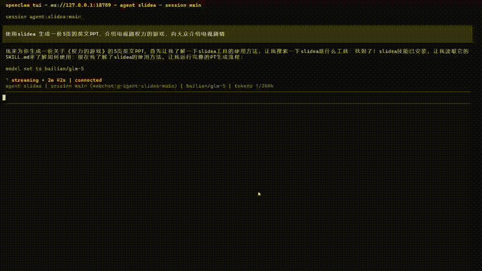
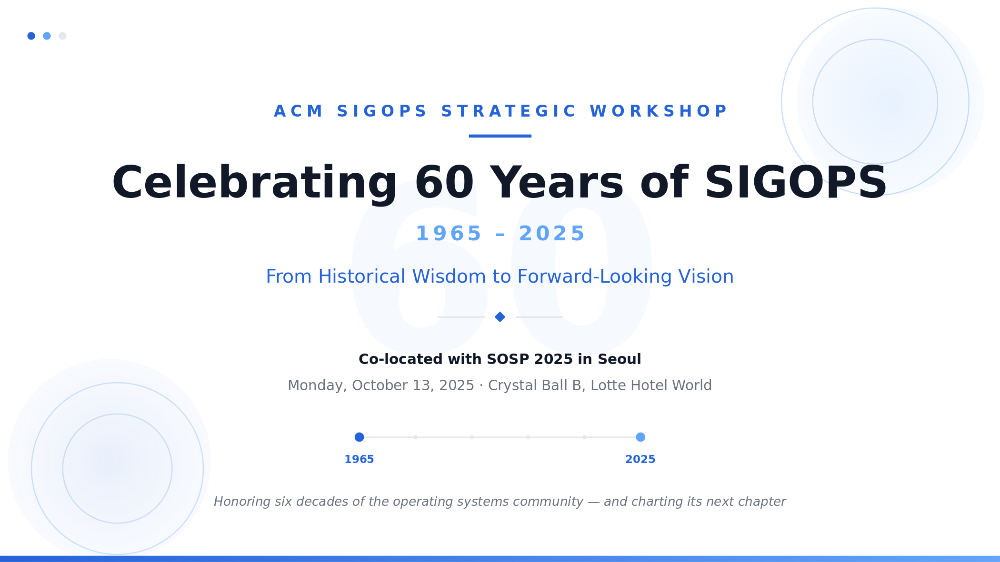

<div align="center">

# Slidea

中文 | [English](README.md)

[](./docs/example/assets/demo.mp4)

</div>

***Slidea*** 是一个**AI 驱动的 PPT 生成 skill**，用于将高层次的PPT 生成需求转化为结构化研究材料、写作思路、幻灯片大纲，并最终生成可演示的 PPT 成稿。

---

| 样例一（英文） | 样例二（英文） |
|----------------|----------------|
| <b>SIGOPS Workshop（Kimi-k2.5）</b><br><a href="./docs/example/sigops.pptx"></a><br><br><details><summary>查看 Prompt</summary><br>Please make me an opening slides for the SIGOPS strategic workshop (https://ipads.se.sjtu.edu.cn/sigops-strategic/), emphasizing the long history of SIGOPS and the community and this is the 60th anniversary of SIGOPS (https://www.sigops.org/about/history/), review the 2015 SOSP History Day (https://sigops.org/s/conferences/sosp/2015/history/), the high-quality of the program, the two great keynote speeches, and the program for visionary talks, as well as the two great panels and workshop Session schedule. Please make around 8-10 slides.</details> | <b>《呼啸山庄》介绍（Kimi-k2.5）</b><br><a href="./docs/example/book.pptx"></a><br><br><details><summary>查看 Prompt</summary><br>Help me create an English PowerPoint presentation to introduce the book Wuthering Heights</details> |

| 样例三（中文） | 样例四（中文） |
|----------------|----------------|
| <b>AI Agent 介绍（Gemini-3-pro）</b><br><a href="./docs/example/agent.pptx"></a><br><br><details><summary>查看 Prompt</summary><br>帮我生成一个30页左右的PPT，内容是关于AI Agent，包括AI Agent基本原理，主要框架、面临的挑战、学术界进展，以及未来的机会点。</details> | <b>幼儿园脱口秀（DeepSeek-V3.2）</b><br><a href="./docs/example/child.pptx"></a><br><br><details><summary>查看 Prompt</summary><br>请帮我生成一份5岁小朋友脱口秀的ppt，演讲题目是“假如我会魔法”</details> |

---

## Slidea 能做什么

给定一个 PPT 生成请求，如“面向产品、技术与业务负责人，生成一份 10 页的 PPT，介绍 AI Agent”，Slidea 可以：

- 将请求解析为结构化需求，
- 从用户输入、URL 与可选搜索中收集资料，
- 生成整份演示文稿的写作思路，
- 将写作思路转化为幻灯片大纲，
- 把每一页渲染为 SVG，并最终导出为可编辑的原生 PPTX。

这套系统面向 agent 驱动的使用场景，它支持分阶段执行、断开后续接执行等灵活的机制。之所以采用分阶段设计，主要有两个原因：

- 研究、规划、大纲生成和渲染分离后，整体生成质量更稳定；
- 中间产物可以被缓存、检查、编辑、恢复或重复利用。

## 快速开始：使用 Agent 安装 Skill（推荐）

Slidea 提供两个可安装到 agent 环境中的 skill：**Slidea**（PPT 生成）和 **Deep Research**（深度研究）。如果你的 agent 平台支持本地 skill，则可以安装其中一个或两个。安装完成之后，按当前二元路由配置 `.env` 即可开始使用。

两个 skill 均已适配 openEuler，Apple Silicon macOS，Windows WSL/PowerShell，以及部分其他 Linux 系统。可在主流 agent 环境中快捷安装并运行，如 OpenClaw、Codex、Claude Code 等。

### Slidea Skill

Slidea 是 AI 驱动的 PPT 生成 skill。默认建议先配置 `DEFAULT_LLM`；如果你要开启 `PREMIUM` 模式，推荐保持 `PREMIUM_LLM_MODEL=google/gemini-3.1-pro-preview` 与 `PREMIUM_LLM_API_BASE_URL=https://openrouter.ai/api/v1` 不变，通常只补充 `PREMIUM_LLM_API_KEY` 即可。

#### 安装 Slidea Skill

可将以下指令发送给你的 Agent：
```text
请直接获取并遵循这里的说明安装 slidea skill：https://raw.gitcode.com/openeuler/capsule/raw/master/application/slidea/skill/slidea/INSTALL.md
```

安装并配置完 Slidea 模型资源后，重启 agent，使其重新加载已安装的 skill。随后通过你的 agent 环境支持的 skill 调用方式来触发 Slidea。

#### 升级 Slidea Skill

要升级已有的 Slidea 安装，请将以下指令发送给你的 Agent：

```text
请直接获取并遵循这里的说明更新 slidea skill：https://raw.gitcode.com/openeuler/capsule/raw/master/application/slidea/skill/slidea/UPDATE.md
```

#### 使用 Slidea Skill

在 OpenClaw 这种环境中，你可能会这样调用：

```text
使用 slidea skill 创建一份关于 AI Agent 的 PPT，10 页左右，面向产品、技术与业务负责人，不要深入洞察
```

在 claude code 这种支持 slash 风格 skill 命令的环境中，你可能会这样调用：

```text
/slidea 创建一份关于 AI Agent 的 PPT，10 页左右，面向产品、技术与业务负责人，不要深入洞察
```

具体语法取决于宿主 agent，但预期体验是一致的：agent 加载 Slidea skill，在必要时补充缺失信息，并将幻灯片生成流水线执行到最终产物。

### Deep Research Skill

Deep Research 是一个可独立安装和使用的深度研究 skill。它可以对给定主题进行多源调查，自动搜索网络、提取相关页面内容，并将发现综合为结构化的研究报告。

#### 安装 Deep Research Skill

要安装 Deep Research skill，请将以下指令发送给你的 Agent：

```text
请直接获取并遵循这里的说明安装 Deep Research skill：https://raw.gitcode.com/openeuler/capsule/raw/master/application/slidea/skill/deep_research/INSTALL.md
```

安装完成后，在已安装的 skill 目录中配置 `.env`，至少需要填写 `DEFAULT_LLM_MODEL`、`DEFAULT_LLM_API_KEY` 和 `DEFAULT_LLM_API_BASE_URL`。可选配置 `TAVILY_API_KEYS` 以启用网络搜索能力。

#### 升级 Deep Research Skill

要升级已有的 Deep Research 安装，请将以下指令发送给你的 Agent：

```text
请直接获取并遵循这里的说明更新 Deep Research skill：https://raw.gitcode.com/openeuler/capsule/raw/master/application/slidea/skill/deep_research/UPDATE.md
```

#### 使用 Deep Research Skill

在 Agent 环境中，通过研究主题调用 Deep Research skill：

```text
使用 deep_research skill 研究 <主题>
```

或使用斜杠命令风格：

```text
/deep_research <研究主题>
```

该 skill 将自动搜索网络、提取并综合信息，最终生成一份结构化的 Markdown 格式研究报告。一次典型的研究运行需要 10-30 分钟。

### 支持平台

| 平台 | 架构 | 支持情况 |
| --- | --- | --- |
| Linux | x86_64 / ARM64 | 支持openEuler |
| Linux | x86_64 | 支持 Ubuntu/Debian |
| Windows | x86_64 / ARM64 | ✅ |
| macOS | Apple Silicon | ✅ |

## 从源码使用

如果你是为了贡献 Slidea 本身，或需要在本地调试仓库代码，可以直接从源码使用 Slidea。

1. 获取源码并进入目录：
   ```bash
   git clone https://gitcode.com/openeuler/capsule.git
   cd capsule/application/slidea
   ```

2. 使用脚本自动创建虚拟环境并安装相关依赖：
   这一步会安装 SVG 渲染路线所需的 Python 依赖并准备 `.env`。
   ```bash
   python3 scripts/install/install.py
   ```

3. 配置环境变量：
   如果脚本还没有自动生成 `.env`，可以先执行：
   ```bash
   cp .env.example .env
   ```
   然后在 `.env` 中至少配置：
   - `SLIDEA_MODE`
   - `DEFAULT_LLM_MODEL`
   - `DEFAULT_LLM_API_KEY`
   - `DEFAULT_LLM_API_BASE_URL`
   当前这些配置仅支持 OpenAI-compatible API。
   最小可运行配置是 `SLIDEA_MODE=ECONOMIC` 加上三项 `DEFAULT_LLM_*`。
   如果 Slidea 连接的是 `model_service`，并希望由 `model_service` 根据 AgentProfile 自动选择模型，可以设置 `MODEL_INVOKE_HANDOVER=true`。此时 Slidea 会忽略 `SLIDEA_MODE`、`PREMIUM_LLM_*` 和 `DEFAULT_VLM_*`，所有文本和视觉请求都发往 `DEFAULT_LLM_API_BASE_URL`，请求中的模型名留空，并携带 AgentProfile header；仍需要配置 `DEFAULT_LLM_API_KEY` 和 `DEFAULT_LLM_API_BASE_URL`，但不再要求 `DEFAULT_LLM_MODEL`。
   Slidea 采用两层模型路由。`DEFAULT_LLM` 是必填项——绝大部分 pipeline 调用点（解析、深度研究、大纲默认分支、页面生成、HTML 视觉复核）都固定走它；没有它 pipeline 起不来。`PREMIUM_LLM` 是可选项——只有 `SLIDEA_MODE=PREMIUM` 时才会用在大纲主结构、SVG 页面生成这两个质量关键调用点；调用失败会自动回退到 `DEFAULT_LLM`。

   三种配置情况：

   - **只配 `DEFAULT_LLM`**：pipeline 能完整跑完。即使 `SLIDEA_MODE=PREMIUM`，premium 路由的调用点也只会打一条警告并回退到 `DEFAULT_LLM`，效果等同 `ECONOMIC`。这是最小可用配置，常规使用足够了。
   - **只配 `PREMIUM_LLM`（DEFAULT_LLM 留空）**：pipeline 在第一个 DEFAULT 路由调用点抛 `Missing configuration for default_llm` 后中断。不支持这种配置。
   - **两个都配 + `SLIDEA_MODE=PREMIUM`**：premium 路由的调用点优先走 `PREMIUM_LLM`，调用失败时自动回退到 `DEFAULT_LLM`。

   如果你希望 premium 路由调用点优先使用高级模型，再额外补充 `PREMIUM_LLM_API_KEY`。默认 `PREMIUM_LLM_MODEL=google/gemini-3.1-pro-preview` 即可；`GLM-5.2` 也是 premium 槽位的推荐选项。

   推荐模型：

   - `DEFAULT_LLM_MODEL`：`google/gemini-3.1-pro-preview`、`GLM-5.2` 或 `deepseek-v4-pro`
   - `PREMIUM_LLM_MODEL`：`google/gemini-3.1-pro-preview` 或 `GLM-5.2`（默认为 gemini）
   - `DEFAULT_VLM_MODEL`：`kimi-2.5` 或 `kimi-2.6`

4. 快速示例：

   ```bash
   .venv/bin/python scripts/run_ppt_pipeline.py \
     --text "生成一份 10 页的 PPT，介绍 AI Agent，不要深入洞察，面向技术人员介绍 Agent 技术发展趋势" \
   ```

   任务发起之后，大约 15 分钟左右，会生成 PPTX 文件，并在 Agent 上下文中告知文件路径。

5. 详细示例 #1：
   
   ```bash
   .venv/bin/python scripts/run_ppt_pipeline.py \
     --text "生成一份 10 页的 PPT，介绍 AI Agent，不要深入洞察" \
     --session-id session_test \
     --run-id id_test
   ```

   其中，若不指定 session-id 和 run-id，系统将采用当前时间作为默认 id 值。上述例子，使用字符串 `session_test` 和 `id_test` 作为示例。

   **恢复被中断的运行**

   生成 PPT 的过程中会中断，并与用户交互。Slidea CLI支持恢复被中断的 PPT 生成任务。

   例如：当 `scripts/run_ppt_pipeline.py` 返回 `stage: "input_required"` 时，表示需要用户补充信息。这种情况下，需要使用相同的 `run_id`、`session_id` 和 `--resume` 再次调用 CLI。

   示例：

   ```bash
   .venv/bin/python scripts/run_ppt_pipeline.py \
   --resume "面向技术人员介绍 Agent 技术发展趋势" \
   --session-id session_test \
   --run-id id_test
   ```

   其中 session_test 和 id_test 是之前已创建但被中断执行的 id 。

6. 详细示例 #2：
   
   ```bash
   .venv/bin/python scripts/run_ppt_pipeline.py \
     --text "生成一份 10 页的 PPT，介绍 AI Agent，请深入洞察，面向技术人员介绍 Agent 技术发展趋势" \
     --session-id session_test \
     --run-id id_test
   ```

   slidea 自带深入洞察能力，如果 PPT 制作主题较为宽泛，可发起深入洞察（20-30 分钟），再基于洞察报告生成 PPTX 文件。


更多命令可以参考 `docs/cli.md`。

如果你不想使用步骤2中的安装脚本自动准备运行环境，也可以手动完成，步骤如下：

```bash
python3 -m venv .venv
. .venv/bin/activate
pip install -r requirements.txt
```

## 仓库结构

- `scripts/`: 面向用户的 CLI 入口，包括 skill 导出、完整流水线、分阶段执行、补渲染以及嵌套的安装辅助脚本
- `skill/`: 导出的 skill 包定义目录，包含 `skill/slidea/`（Slidea PPT 生成 skill）和 `skill/deep_research/`（Deep Research 深度研究 skill），各自包含 `SKILL.md`、`INSTALL.md`、`UPDATE.md` 及 skill 清单
- `core/`: 主要的 LangGraph 应用，包括深度研究、PPT 生成以及共享核心工具
- `docs/`: 面向公开仓库读者的文档，包括快速开始、CLI、架构和 app 说明
- `tests/`: 针对可移植性、CLI 契约与运行时行为的回归测试

## 核心子系统

### PPT Generator

`core/ppt_generator/` 负责面向演示文稿的生成。

它会把源材料转化为：

- 演示文稿的写作思路，
- 幻灯片大纲，
- 每页 SVG 渲染结果，
- 以及最终可编辑的原生 PPTX 产物。

这个子系统被拆分出来，是为了把“如何思考这份 deck”与“如何把 deck 渲染出来”这两类问题分开处理。

使用示例：

```bash
.venv/bin/python scripts/run_ppt_pipeline.py \
  --text "生成一份 10 页的 PPT，介绍 AI Agent，不要深入洞察，面向技术人员介绍 Agent 技术发展趋势"
```

在 PPT 渲染过程中，会采用 fewshots 的模式，让模型输出的排版保持一致的风格。

当前，Slidea 内置了浅色通用，深色通用，红色政治，蓝色学术，幼小科普，中文艺术，英文艺术 7 种模板。Slidea默认会根据用户输入的主题自行选择最合适的模板渲染排版，但用户也可以直接在 PPT 生成任务的请求中，明确要求Slidea采用何种风格的模板。

### Deep Research

`core/deep_research/` 负责递归研究和长文综合。

它不负责幻灯片渲染，而是将一个宽泛的需求扩展成结构化研究过程，包括问题拆解、证据收集、缺口审视，以及生成可供演示流水线消费的研究产出。

当任务在进入幻灯片规划前需要先形成洞察时，应关注这一部分。

## CLI 概览

Slidea 主要暴露三个脚本入口：

- `scripts/install/install.py`: 初始化源码工作区或导出 skill 包的本地运行时依赖，skill 安装过程中会被调用
- `scripts/export_skill.py`: 从源码树导出 skill 包，skill 安装过程中会被调用
- `scripts/run_ppt_pipeline.py`: 主生成流水线，支持分阶段执行，PPT 生成任务发起时被调用
- `scripts/patch_render_missing.py`: 对缺失页或指定页进行补渲染，PPT 内容生成不完整时被调用

完整参数说明和 JSON 返回契约请参考 [CLI Reference](docs/cli.md)。

## 输出与缓存

每次 PPT 生成任务的运行都由一个 `run_id` 标识，PPT 生成任务执行过程中的所有中间结果将缓存在 slidea skill 安装目录下的`output/<run_id>/`

缓存的常见文件包括：

- `run.json`
- `references/`
- `research/`
- `thought/thought.md`
- `outline/outline.json`
- `ppt.json`

最终渲染产物将保存在 `ppt.json` 记录的 `render_dir` 路径下。SVG 渲染路线会产出 `svg_output/*.svg`（LLM 原始输出）、`svg_final/*.svg`（已嵌入图片的最终版）以及一份可编辑的原生 `*.pptx`。这种分离让系统可以在不重跑全流程的情况下，重新进入某一阶段或执行补渲染。

## 运行时降级行为

运行时是由配置驱动的。当可选服务缺失时，系统会降级，而不是整体失败：

- 没有 Tavily 配置：跳过网页搜索
- embedding 被禁用或未配置：跳过基于 embedding 的排序
- 没有 VLM 配置：跳过基于 VLM 的图片评分与分发能力

## 文档导航

根据你的目标，可以从这里开始：

- [Documentation Index](docs/README.md)
- [Quickstart](docs/quickstart.md)
- [CLI Reference](docs/cli.md)
- [Architecture Overview](docs/architecture.md)
- [App Overview](docs/core/README.md)
- [Deep Research App](docs/core/deep-research.md)
- [PPT Generator App](docs/core/ppt-generator.md)

## 贡献

以下方向的贡献价值最高：

- CLI 契约与运行时稳定性
- research graph 质量
- 大纲或渲染质量
- 可移植性与环境处理
- 对外公开文档

如果你修改了行为，请在同一个改动中同步更新 `docs/` 下对应文档。

## HTML 渲染路线（可选）

上文描述的 SVG 路线是默认路线，也是 `skill/SKILL.md` 暴露给宿主 agent 的唯一路线。Slidea 还保留了 HTML 渲染路线作为可选备用方案，适合需要 HTML/CSS 表现力、需要走 HTML→PDF→PPTX 转换流程的用户。该路线为**按需启用**，需要额外系统依赖。

HTML 路线会通过无头 Chromium 浏览器把每一页渲染为 HTML/CSS，合并每页 PDF 后再通过 LibreOffice 转换为 PPTX。它在代码库中完整保留（`core/ppt_generator/thought_to_ppt/page_generators/` 与 `core/ppt_generator/utils/browser.py`），但默认不安装也不暴露。

### 何时使用 HTML 路线

仅在以下任一情况属实时才选择 HTML 路线：

- 你确实需要 HTML/CSS 视觉模型（例如 SVG 无法表达的某些复杂 CSS 布局）；
- 你希望最终产物中除 PPTX 外还包含 PDF 中间产物；
- 你在调试旧版流水线。

其他场景下，请优先使用默认的 SVG 路线——它无需 Playwright 或 LibreOffice，可直接产出可编辑的原生 PPTX。

### 1. 安装 HTML 路线额外依赖

在 skill 目录下执行：

```bash
.venv/bin/pip install playwright PyPDF2
.venv/bin/python -m playwright install chromium
```

此外需要安装 LibreOffice（≥ 25.2）。可从 `https://www.libreoffice.org/download/download-libreoffice/` 下载，或通过系统包管理器安装。

### 2. 使用 `--with-html-route` 让安装脚本一并准备（可选）

如果你希望安装脚本直接帮你装好 Playwright Chromium 以及一份本地 LibreOffice，可以执行：

```bash
python3 scripts/install/install.py --with-html-route
```

`--with-html-route` 会重新启用默认 SVG-only 安装所跳过的 Playwright Chromium 安装步骤与 LibreOffice 下载/检查逻辑。

### 3. 以 `--render-mode html` 运行

```bash
.venv/bin/python scripts/run_ppt_pipeline.py \
  --text "<请求内容>" \
  --render-mode html
```

### HTML 路线的额外产出

HTML 路线会在渲染目录下额外写出：

- 每页的 `*.html` 文件（一页一份），
- 合并后的 `*.pdf`，
- 通过 LibreOffice 把 PDF 转 PPTX 得到的最终 `*.pptx`。

HTML 运行的 `ppt.json` 会记录 `render_mode: "html"`，并相应记录 `pdf_path` 与 `pptx_path`。

### HTML 路线专属的降级行为

启用 HTML 路线时，会多出一条降级规则：

- 没有可用的 LibreOffice 转换：保留 HTML/PDF 输出，跳过 PPTX 转换。（默认 SVG 路线不依赖 LibreOffice，不受此规则影响。）

### 注意事项

- `--render-mode html` **不会**通过 `skill/SKILL.md` 暴露给宿主 agent。agent 使用 Slidea skill 时，始终走默认 SVG 路线，除非你显式把 HTML 路线命令交给它。
- `scripts/html_to_pptx.py`（独立的 HTML→PPTX 转换器）以及 `scripts/patch_render_missing.py`（当 `ppt.json` 记录的是 `render_mode: "html"` 时）在补齐 HTML 路线依赖后仍然可用。
- 如果你之前手动安装过 Playwright / PyPDF2 / LibreOffice，之后某次升级改动了 `requirements.txt`，`.venv` 中已装的包不会被自动卸载。HTML 路线通常仍可使用；若失效，按上述步骤重装即可。

## 第三方声明

本项目包含 [PPT Master](https://github.com/hugohe3/ppt-master) 的代码，采用 MIT 许可证，详见 [THIRD_PARTY_NOTICES](THIRD_PARTY_NOTICES)。
